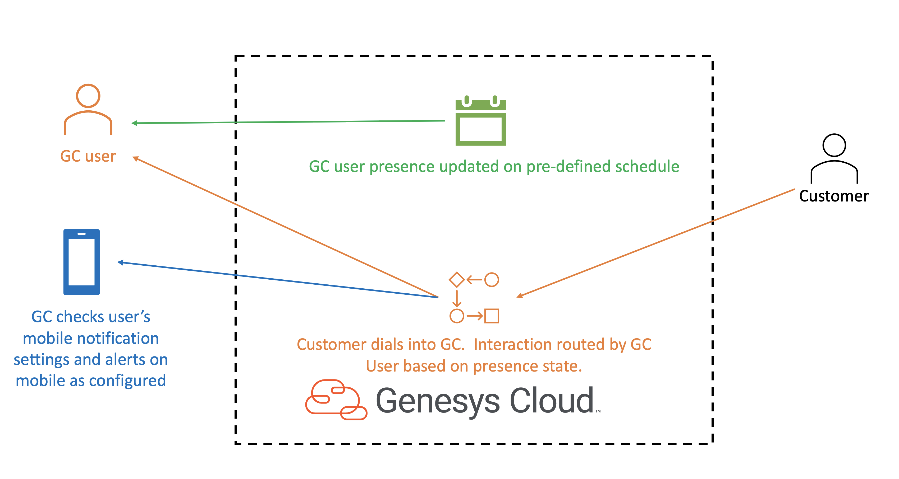

# Setup a Genesys Cloud Associate User

This Genesys Cloud Developer Blueprint explains how to set up a Genesys Cloud Associate User.  Specifically, to optimize the experience for a Genesys Cloud user receiving ACD (automatic call distribution) Voice Interactions on a mobile device.

When a GC Associate User's work schedule dictates, the GC platform automatically places the GC user into the appropriate presence state to receive ACD Voice interactions on their mobile device.  Optional settings such as queue timeout are also covered.

