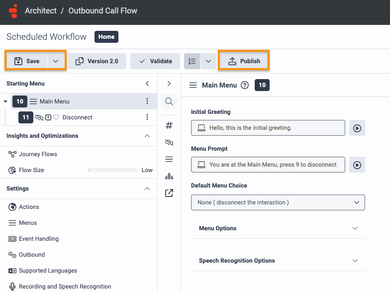
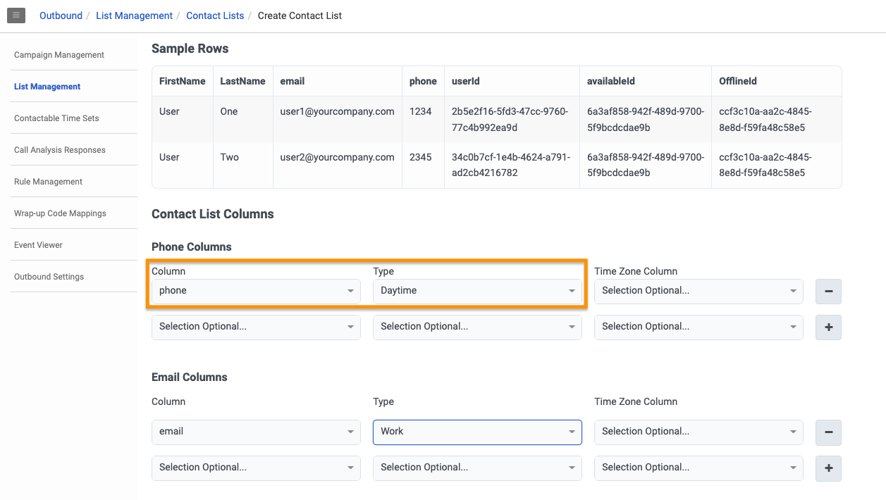
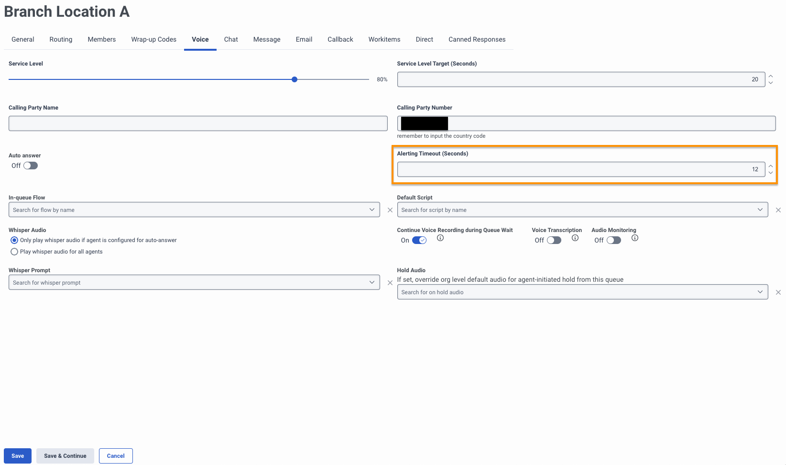

This Genesys Cloud Developer Blueprint explains how to set up a Genesys Cloud Associate User.  Specifically, to optimize the experience for a Genesys Cloud user receiving ACD (automatic call distribution) Voice Interactions on a mobile device.

When a GC Associate User's work schedule dictates, the GC platform automatically places the GC user into the appropriate presence state to receive ACD Voice interactions on their mobile device.  Optional settings such as queue timeout are also covered.

## Solution components

* **Genesys Cloud** - A suite of Genesys cloud services for enterprise-grade communications, collaboration, and contact center management. Contact center agents use the Genesys Cloud user interface.
* **Genesys Cloud API** - A set of RESTful APIs that enables you to extend and customize your Genesys Cloud environment.

## Prerequisites

### Specialized knowledge

* Administrator-level knowledge of Genesys Cloud

### Genesys Cloud account

* A Genesys Cloud CX 1 license. For more information, see [Genesys Cloud Pricing](https://www.genesys.com/pricing "Opens the Genesys Cloud pricing article").
* The Master Admin role in Genesys Cloud. For more information, see [Roles and permissions overview](https://help.mypurecloud.com/?p=24360 "Opens the Roles and permissions overview article") in the Genesys Cloud Resource Center.

## Configure Genesys Cloud

### Create custom roles for use with Genesys Cloud OAuth clients

Create a custom role for use with a Genesys Cloud OAuth client with the following permissions.

| Roles           | Permissions | Role Name |
|-----------------|-------------------------|---------|
| Custom role 1 | **Presence** > **User Presence** > **Edit**  | Update GC User Presence |

To create a custom role in Genesys Cloud:

1. Navigate to **Admin** > **Roles/Permissions** and click **Add Role**.

   

2. Enter the **Name** for your custom role.

    

3. Search and select the required permission for each of the custom role.
   
4. Click **Save** to assign the appropriate permission to your custom role.

:::primary
  **Note:** Assign this custom role to your user before creating the Genesys Cloud OAuth client.
  :::

### Create an OAuth client for use with a Genesys Cloud data action integration

To enable a Genesys Cloud data action to make public API requests on behalf of your Genesys Cloud organization, use an OAuth client to configure authentication with Genesys Cloud.

Create an OAuth client for use with the data action integration with the following custom roles.

| OAuth Client   | Custom role | OAuth Client Name |
|----------------|-------------------------------|-------|
| OAuth Client 1 | Update GC User Presence | Update GC User Presence |

To create an OAuth Client in Genesys Cloud:

1. Navigate to **Admin** > **Integrations** > **OAuth** and click **Add Client**.

   

2. Enter the name for the OAuth client and select **Client Credentials** as the grant type. Click the **Roles** tab and assign the required role for the OAuth client.

     

3. Click **Save**. Copy the client ID and the client secret values for later use.

   

:::primary
  **Note:** Ensure that you copy the client ID and client secret values for each of the OAuth clients.
  :::

### Add Genesys Cloud data action integration

Add a Genesys cloud data action integration for each OAuth client being used with this blueprint to call the Genesys Cloud public API to:
* Update a Genesys Cloud user's presence

To create a data action integration in Genesys Cloud:

1. Navigate to **Admin** > **Integrations** > **Integrations** and install the **Genesys Cloud Data Actions** integration. For more information, see [About the data actions integrations](https://help.mypurecloud.com/?p=209478 "Opens the About the data actions integrations article") in the Genesys Cloud Resource Center.

   

2. Enter a name for the Genesys Cloud data action, such as Update Genesys Cloud User Presence in this blueprint solution.

   

3. On the **Configuration** tab, click **Credentials** and then click **Configure**.

   

4. Enter the client ID and client secret that you saved for the Presence Public API [(OAuth Client 1)](#create-oauth-clients-for-use-with-genesys-cloud-data-action-integrations "Goes to the create an OAuth Client section"). Click **OK** and save the data action.

   

5. Navigate to the Integrations page and set the presence data action integration to **Active**.

   

### Import the Genesys Cloud data actions

Import the following JSON files from the [gc-associate-user-setup repo](https://github.com/GenesysCloudBlueprints/gc-associate-user-setup) GitHub repository:
* `GC-User-Presence-Update-Secure.custom.json`

1. From the [gc-associate-user-setup repo](https://github.com/GenesysCloudBlueprints/gc-associate-user-setup) GitHub repository, download the `GC-User-Presence-Update-Secure.custom.json` file.

2. In Genesys Cloud, navigate to **Integrations** > **Actions** and click **Import**.

   

3. Select the `GC-User-Presence-Update-Secure.custom.json` file and associate with the [GC User Presence Update](#add-genesys-cloud-data-action-integrations "Goes to the Add Genesys Cloud data action integrations section") integration, and then click **Import Action**.

   

### Import the Architect flows

This solution includes one Outbound Call Architect low. This flow is required for the Scheduled Workflow Campaigns.

1. Download the `Scheduled Workflow.i3OutboundFlow` file from the [gc-associate-user-setup repo](https://github.com/GenesysCloudBlueprints/gc-associate-user-setup) GitHub repository.

2. In Genesys Cloud, navigate to **Admin** > **Architect** > **Flows:Outbound Call** and click **Add**.

   

3. Enter a name for the flow and click **Create Flow**.

   

4. From the **Save** menu, click **Import**.

   

5. Select the downloaded **Scheduled Workflow.i3OutboundFlow** file and click **Import**.

   

6. Review your flow. Click **Save** and then click **Publish**.

### Campaign Setup

This solution requires a Campaign for each scheduled presence change your business rules require.  This blueprint includes two campaigns, one to set GC Users to available at 8am Eastern time and one to set GC Users to offline at 4:30pm Eastern time.

1. In Genesys Cloud, navigate to **Admin** > **Outbound** > **List Management** and click **Create New**.  

  

2. Download the `ScheduledWorkflowContactList.csv` file from the [gc-associate-user-setup repo](https://github.com/GenesysCloudBlueprints/gc-associate-user-setup) GitHub repository.

3. Name your Contact List

4. Populate the `ScheduledWorkflowContactList.csv` file with the userIds and systemPresenceIds of the people and presence values from your GC organization you want to include in your scheduled workflows.

5. Upload the csv file of your list

6. Map the required columns

7. Save List

8. Navigate to **Admin** > **Outbound** > **Call Analysis Response** and click **Create New**.  

9. Fill in the required fields and click **Save**

10. Navigate to **Admin** > **Outbound** > **Call Rule Sets** and click **Create New**.  

11. Name your Call Rule Set and select your Contact List

12. Add a New Rule to your Call Rule Set

13. Add Name, Category and Condition information to your rule set to match the screenshot below

14. Define first action to map Data Action this Call Rule Set rule and add a second action

15. Select **Do Not Dial** as the second action and then click **Save**

16. Save Call Rule set

17. Navigate to **Admin** > **Outbound** > **Call Rule Sets** and click **Create New**.  

18. Name your second Call Rule Set and select your Contact List

19. Add a New Rule to your Call Rule Set

20. Add Name, Category and Condition information to your rule set to match the screenshot below

21. Define first action to map Data Action this Call Rule Set rule and add a second action

22. Select **Do Not Dial** as the second action and then click **Save**

23. Save Call Rule set

24. Navigate to **Admin** > **Outbound** > **Campaign Management** > **Voice Campaigns** and click **Create New**.

25. Fill in the required fields on the campaign record and click **Save**

26. Navigate to **Admin** > **Outbound** > **Campaign Management** > **Voice Campaigns** and click **Create New**.  

27. Fill in the required fields on the campaign record and click **Save**

28. Navigate to **Admin** > **Outbound** > **Campaign Management** > **Schedule** and click the **+** icon.  

29. Fill in the required fields on the campaign schedule, update the recurrence and schedule to match your business rules and click **Save**

30. Navigate to **Admin** > **Outbound** > **Campaign Management** > **Schedule** and click the **+** icon.  

31. Fill in the required fields on the campaign schedule, update the recurrence and schedule to match your business rules and click **Save**

## Set Queue Timeout
Direct Routing users and traditional Agent users receiving ACD voice interactions must be associated with a queue.  For mobile users, it is recommended to extend the alerting timeout on the queue to ensure the mobile user has time to answer the voice interaction prior to timing out.

1. Navigate to **Admin** > **Contact Center** > **Queues** and select the desired queue.

2. From the **Voice** tab, extend the **Alerting Timeout (Seconds)** value to match your business needs and click **Save**.

## Additional resources

* [Genesys Cloud API Explorer](https://developer.genesys.cloud/devapps/api-explorer "Opens the GC API Explorer") in the Genesys Cloud Developer Center
* The [gc-associate-user-setup repo](https://github.com/GenesysCloudBlueprints/gc-associate-user-setup) GitHub repository
